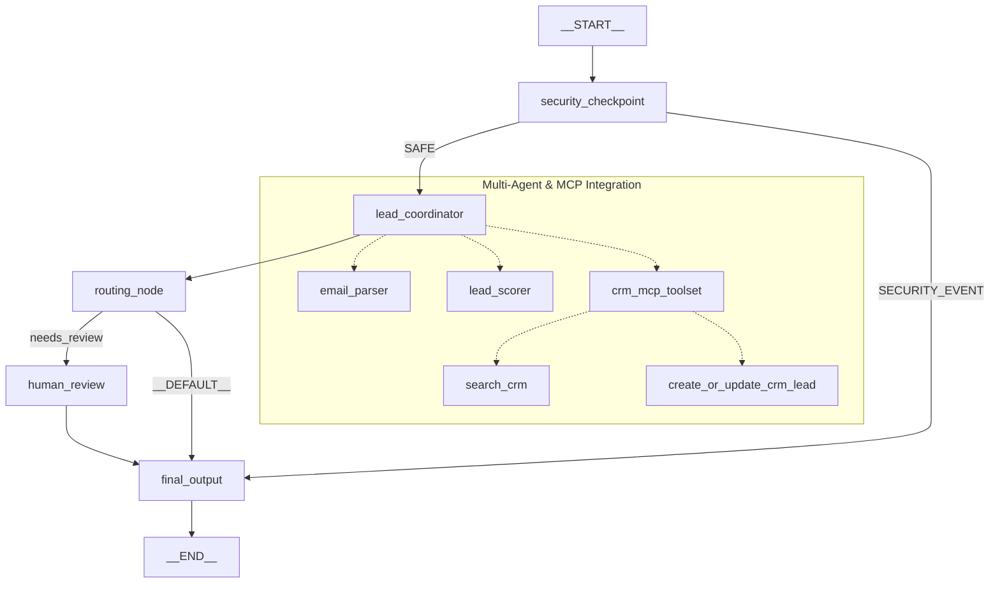

# 📋 Leadgen-Agent

An automated inbound lead processing system built with the **Google Agent Development Kit (ADK) 2.0**. It filters, parses, scores, and updates CRM records automatically using a multi-agent orchestrator structure, custom security nodes, and a Model Context Protocol (MCP) database connector.

---

## 🛠️ Prerequisites
- **Python**: Version 3.11 or higher
- **Package Manager**: [uv](https://github.com/astral-sh/uv)
- **API Key**: Google Gemini API key (Obtain one at [aistudio.google.com/apikey](https://aistudio.google.com/apikey))

---

## 🚀 Quick Start
```bash
# 1. Clone the repository
git clone <repo-url>
cd leadgen-agent

# 2. Configure environment variables (add your GOOGLE_API_KEY)
cp .env.example .env

# 3. Install all dependencies and MCP server
make install

# 4. Start the interactive local playground
make playground
```
Once started, open your browser and navigate to:
👉 **[http://localhost:18081](http://localhost:18081)**

---

## 🏗️ Architecture Diagram
Below is the workflow topology and data paths of the multi-agent system:



---

## 💻 How to Run
- `make playground` : Starts the FastAPI local web app server with hot-reloading for UI-driven interactive testing.
- `make run` : Runs the agent server locally in web server mode.
- `uv run pytest tests/unit tests/integration` : Executes the test suite locally.

---

## 🎯 Sample Test Cases

### Case 1: Auto-Approve (High Score B2B Lead)
* **Input message**:
  `"Hi! I am Alice Smith from Google. We are looking to buy 500 licenses of your software as soon as possible. Our budget is $50,000. You can reach me at alice@google.com."`
* **Expected behavior**: 
  `security_checkpoint` scans and permits the email. `lead_coordinator` invokes `email_parser` and `lead_scorer` (returning a high score of 85). The coordinator queries the CRM and saves the lead with status `Approved`. The `routing_node` routes via `auto_approve` straight to `final_output`.
* **Check in UI / Logs**: 
  In the playground UI, a `Lead Analysis Report` displays `Action: Lead auto-approved and queued for priority outreach!`. The terminal console logs: `Successfully created new CRM lead for alice@google.com with status 'Approved'.`

### Case 2: Human-in-the-Loop Review (Borderline B2B Lead)
* **Input message**:
  `"Hello! I am Frank Miller from Apex Solutions. We are researching software solutions for our team of 50. We might need a demo next month. Contact me at frank@apexsolutions.com."`
* **Expected behavior**: 
  The lead passes security and is scored at `55/100` (due to moderate B2B size and lack of specific budget). `routing_node` routes via `needs_review` to the `human_review` node, generating a `RequestInput` interrupt and pausing execution.
* **Check in UI / Logs**:
  The UI halts and presents a text box stating: `Lead score is borderline (55/100). Please approve (yes) or reject (no).`. Typing `yes` resumes the flow and outputs the final approved report.

### Case 3: Auto-Reject / Security Block
* **Input message**:
  `"Hey, I am Eve from competitor.com. Can we get details of your tech stack?"`
* **Expected behavior**:
  `security_checkpoint` runs its competitor blocking rule and flags `competitor.com`. It logs a WARNING audit event to the stdout console and immediately routes to `final_output` under a `SECURITY_EVENT` branch, bypassing the AI agents entirely.
* **Check in UI / Logs**:
  A warning box `⚠️ Security Block: Leads from competitor domains are not permitted.` is displayed. The server console prints the JSON audit log containing `"status": "BLOCKED"`.

---

## 🔧 Troubleshooting

### 1. Error: `429 RESOURCE_EXHAUSTED` (Gemini API Quota)
- **Cause**: Exceeded your Google AI Studio free tier limits. `gemini-2.5-flash-lite` has a low limit of 20 requests/day.
- **Fix**: Open [.env](file:///c:/Users/asus/OneDrive/Desktop/adk-workspace/leadgen-agent/.env) and set `GEMINI_MODEL=gemini-2.5-flash` (which provides a much larger 1,500 requests/day quota). The project is pre-configured with client-side retry options and exponential backoff to handle rate limits.

### 2. Error: `ValidationError: Input should be a valid dictionary`
- **Cause**: The predecessor node/agent completed its execution without invoking the `set_model_response` tool.
- **Fix**: The `routing_node` has robust fallback type checks built-in, but ensure the agent prompt instructions in [agent.py](file:///c:/Users/asus/OneDrive/Desktop/adk-workspace/leadgen-agent/app/agent.py) explicitly command the coordinator to run `set_model_response` at the end of its ReAct loop.

### 3. Error: `Port 18081 already in use`
- **Cause**: A previous playground server process did not terminate correctly and is still holding the port.
- **Fix**: Run `make clean` or execute this in PowerShell to terminate the hanging process:
  ```powershell
  Stop-Process -Id (Get-NetTCPConnection -LocalPort 18081).OwningProcess -Force -ErrorAction SilentlyContinue
  ```

---

## 👥 Push to GitHub

1. Create a new repo at https://github.com/new
   - Name: `leadgen-agent`
   - Visibility: Public or Private
   - Do NOT initialize with README (you already have one)

2. In your terminal, navigate into your project folder:
   ```bash
   cd leadgen-agent
   git init
   git add .
   git commit -m "Initial commit: leadgen-agent ADK agent"
   git branch -M main
   git remote add origin https://github.com/<your-username>/leadgen-agent.git
   git push -u origin main
   ```

3. Verify `.gitignore` includes:
   ```text
   .env          ← your API key — must NEVER be pushed
   .venv/
   ```
