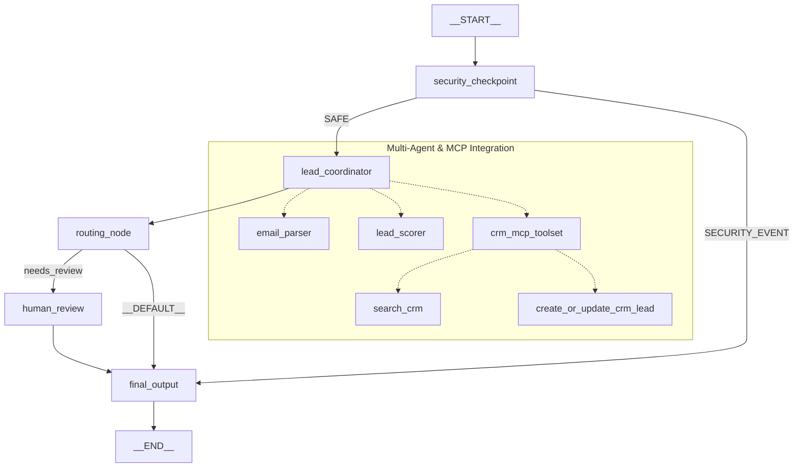

# 📝 Project Submission: Leadgen-Agent

This write-up describes the **Leadgen-Agent**, an automated lead triage, verification, and CRM integration system built using the **Google Agent Development Kit (ADK) 2.0**.

---

## 1. Problem Statement
In B2B sales operations, processing inbound lead emails manually is slow, error-prone, and poses significant security risks. 
* **SDR Workload**: Sales Development Representatives (SDRs) spend hours sorting spam, competitive intelligence requests, and low-quality inquiries from high-value opportunities.
* **Data Security & PII**: Directly exposing customer data (like Social Security Numbers or credit card details) to large language models or downstream CRMs risks compliance violations (like GDPR or PCI-DSS).
* **Speed to Lead**: Borderline leads require human validation, but auto-approvable high-value leads should be routed and registered in the CRM immediately to minimize outreach delay.

The **Leadgen-Agent** addresses these challenges by automating the entire validation, parsing, scoring, CRM lookup, and dynamic routing process within a secure, self-healing pipeline.

---

## 2. Solution Architecture
The workflow is built as a stateful graph that securely manages the data flow from ingestion to routing:

---

## 3. ADK Concepts & File References

* **ADK Workflow**: Coordinates the step-by-step routing of the lead. Defined in [app/agent.py:L321-331](file:///c:/Users/asus/OneDrive/Desktop/adk-workspace/leadgen-agent/app/agent.py#L321-L331) using the `Workflow` class.
* **LlmAgent**: Orchestrator and specialized worker agents configured with specific instructions and outputs:
  - `lead_coordinator` (Orchestrator): [app/agent.py:L93-108](file:///c:/Users/asus/OneDrive/Desktop/adk-workspace/leadgen-agent/app/agent.py#L93-L108)
  - `email_parser` (Worker): [app/agent.py:L59-72](file:///c:/Users/asus/OneDrive/Desktop/adk-workspace/leadgen-agent/app/agent.py#L59-L72)
  - `lead_scorer` (Worker): [app/agent.py:L74-89](file:///c:/Users/asus/OneDrive/Desktop/adk-workspace/leadgen-agent/app/agent.py#L74-L89)
* **AgentTool**: Packages sub-agents as tools so the coordinator can dispatch calls to them dynamically during its ReAct loop. Defined in [app/agent.py:L106](file:///c:/Users/asus/OneDrive/Desktop/adk-workspace/leadgen-agent/app/agent.py#L106) (`AgentTool(email_parser)`, `AgentTool(lead_scorer)`).
* **MCP Server**: Connects simulated CRM database operations to the LLM agent via Stdio transport. Initialized in [app/agent.py:L47-54](file:///c:/Users/asus/OneDrive/Desktop/adk-workspace/leadgen-agent/app/agent.py#L47-L54) and implemented in [app/mcp_server.py](file:///c:/Users/asus/OneDrive/Desktop/adk-workspace/leadgen-agent/app/mcp_server.py).
* **Security Checkpoint**: Pre-filters and sanitizes inputs before LLM consumption. Implemented as the first node in [app/agent.py:L113-199](file:///c:/Users/asus/OneDrive/Desktop/adk-workspace/leadgen-agent/app/agent.py#L113-L199).
* **Agents CLI**: Scaffolds, evaluates, and deploys the agent. Upgraded to `0.6.0` configuration in [agents-cli-manifest.yaml](file:///c:/Users/asus/OneDrive/Desktop/adk-workspace/leadgen-agent/agents-cli-manifest.yaml).

---

## 4. Security Design
We implemented three key security controls in [app/agent.py](file:///c:/Users/asus/OneDrive/Desktop/adk-workspace/leadgen-agent/app/agent.py):
1. **PII Redaction**: Pre-processes raw email text to regex-scrub Social Security Numbers (SSNs) and Credit Card numbers to prevent accidental LLM data leakage or storage in CRM logs.
2. **Competitor Blocking**: Parses emails for competitive domains (e.g. `@competitor.com`, `@rivalcorp.com`). If detected, the email is flagged and routed directly to a rejection output, saving token costs and blocking competitive espionage.
3. **Prompt Injection Detection**: Scans the input string for key prompt injection command override patterns (e.g., `ignore previous instructions`, `jailbreak`, `override`). If found, the request is instantly blocked and flagged as a security event.
4. **Structured Auditing**: Emits a structured JSON audit log containing session metadata, SSN/CC redaction status, and block reasons for security logging and compliance tracking.

---

## 5. MCP Server Design
The CRM MCP Server ([app/mcp_server.py](file:///c:/Users/asus/OneDrive/Desktop/adk-workspace/leadgen-agent/app/mcp_server.py)) provides standard tools for B2B intelligence and CRM records:
* **`get_company_profile(domain: str)`**: Fetches company statistics (size, industry, location) for B2B domain enrichment.
* **`search_crm(email: str)`**: Checks if the sender has an existing lead entry in the database.
* **`create_or_update_crm_lead(lead_details: dict)`**: Inserts new lead entries or updates existing records with the parsed score, status, and summary details.

---

## 6. Human-in-the-Loop (HITL) Flow
Leads with borderline quality (scores between `40` and `69`) represent potential opportunities that a hard automated rule might misclassify. 
* The **`routing_node`** directs these borderline leads to the **`human_review`** node.
* The **`human_review`** node yields an ADK `RequestInput` event, pausing the execution thread and requesting user confirmation in the playground interface.
* Once the user inputs `yes` (or `no`), the workflow resumes, updates the lead status, modifies the reasoning history, and proceeds to format the final output.

---

## 7. Demo Walkthrough
The workflow was validated with three representative cases (documented in the project [README.md](file:///c:/Users/asus/OneDrive/Desktop/adk-workspace/leadgen-agent/README.md)):
1. **Alice Smith (Google)**: High-quality lead with 500 licenses request and $50k budget. Scored **85/100** and auto-approved immediately.
2. **Frank Miller (Apex Solutions)**: Borderline lead (50 users, demo request, no budget specified). Scored **55/100**, paused workflow, requested human review, and successfully resumed on `yes`.
3. **Eve (competitor.com)**: Competitor domain flagged at `security_checkpoint`, blocked, logged, and auto-rejected without invoking LLM models.

---

## 8. Impact & Value Statement
The **Leadgen-Agent** delivers immediate B2B operational improvements:
* **Sales Speed**: Decreases "speed to lead" from hours to seconds for highly-qualified prospects.
* **Operational Savings**: Automates B2B scoring, saving SDRs from manual filtering.
* **Compliance Safeguards**: Ensures strict data compliance by scrubbing PII before LLM processing.
